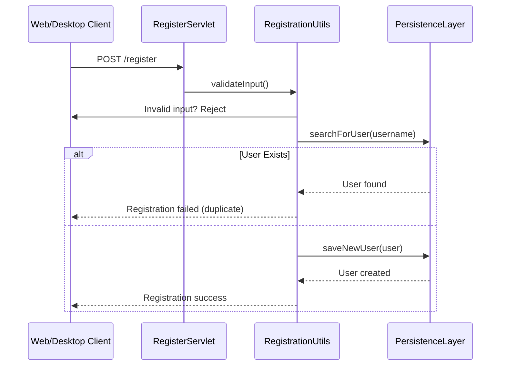
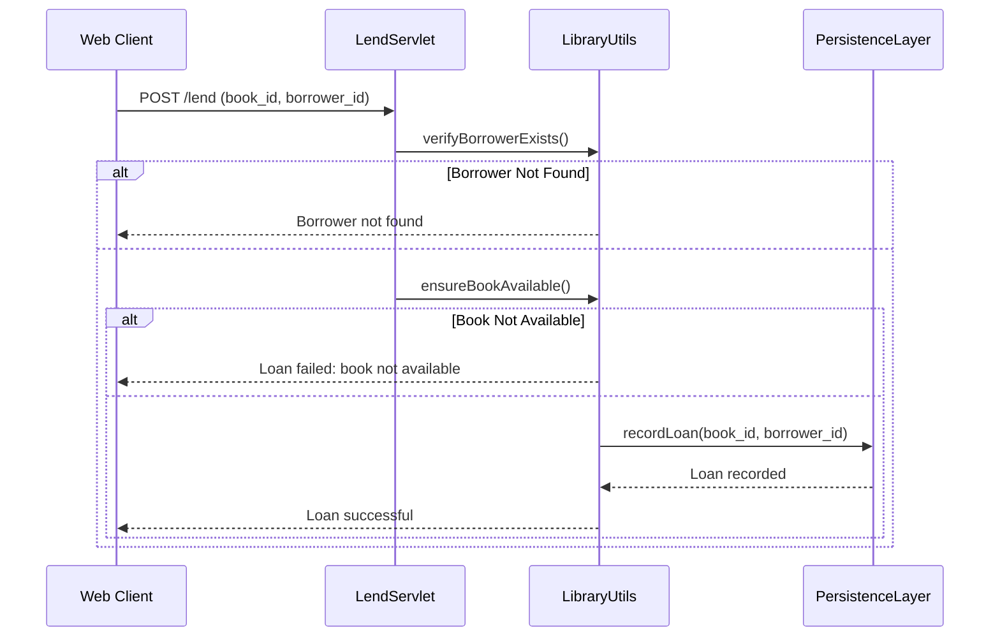
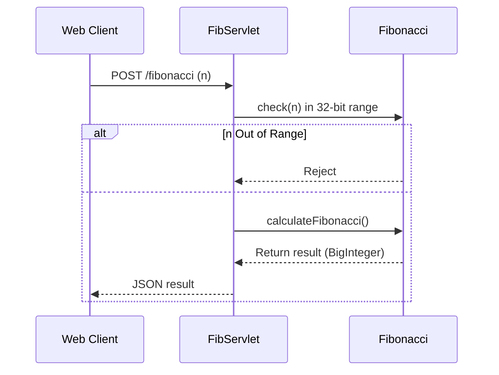

<think>
Okay, let's start by breaking down the user's problem. They've given me three codebase summaries and want a single comprehensive architectural summary aimed at microservice decomposition. The user emphasized not to lose any details, so I need to make sure I incorporate all the key elements from the original summaries.

First, I need to understand each of the three provided summaries. The first summary gives an overview of the existing monolithic structure, including the main components like the web application's servlets, the desktop app for auto insurance, the shared H2 DB with Flyway, and the deployment practices using Gradle and Docker. It also mentions the BDD/TDD approach.

The second summary focuses on decomposing the codebase into microservices. It lists the three main services (Authentication, Library, Math) and talks about the persistence layer, noting that in a microservices setup each would have its own DB. There's also information about APIs and domain models.

The third summary reinforces the decomposition plan but adds more about the existing code structures and potential future steps. It also mentions the current persistence as a candidate for a shared component or a separate service but highlights the move towards isolated DBs in microservices.

Now, I need to merge these into one comprehensive summary without redundancy. Let's start by outlining the main components and then delve into each service's responsibilities, APIs, data models, dependencies, and deployment. Also, the user wants information on microservice decomposition plans, architectural risks, and recommendations.

One thing to note is that the current codebase is a monolith with shared DB schemas, but moving to microservices would require each service to have its own DB to maintain loose coupling. The persistence layer, which uses Flyway in the monolith, would need to be adapted in the microservices context—either as a shared service or managed individually.

For the Authentication Service, I should include the servlets, business logic, and data models. The Library Service has similar components but involves book management and loans. The Math Service is stateless and requires no DB. The Auto Insurance Service is a desktop app that might transition to a web-based one but currently uses a script server for interactions.

Testing is important, so including the TDD/BDD practices, JUnit, Cucumber, Selenium, and the CI/CD pipeline with Gradle, Jenkins, and Docker is necessary. Deployment aspects are also covered in the summaries, so that should be included.

Architectural risks such as DB coupling and inter-service communication need to be addressed. The summary should mention moving towards REST/GRPC, handling shared DB schemas, and improving security with JWT.

I should structure the summary logically, starting with the overall architecture, component overview, APIs, data models, dependencies, deployment, decomposition plan, risks, and recommendations. Make sure to mention each service's responsibilities, key classes, and interactions. Also, detail the data models and how they would change in a microservices setup.

Need to ensure that the transition from monolith to microservices is clearly outlined, including the steps for each service, the communication patterns they would use, and the DB strategies. Also, include the artifact lists referencing specific classes and files from the original codebases.

Finally, wrap it up with a concise summary that ties everything together, emphasizing modularity, scalability, and the benefits of the proposed microservices architecture. Make sure all technical terms are accurately represented and that the summary is easy to follow, avoiding redundancy but covering all necessary points.
</think>

### Comprehensive Microservice Architectural Summary for 7ep-demo Codebase

---

#### **1. Overall Architecture Overview**
The **7ep-demo** codebase is a **modular Java monolith** with a **servlet-based web application (Tomcat)** and a **desktop auto insurance calculator**. It uses **H2 in-memory or file-based database** with **Flyway** for schema migration. The system supports **Test-Driven and Behavior-Driven Development (BDD/TDD)** using **JUnit**, **Cucumber**, **Selenium**, **PyTest**, and **Behave**. 

The codebase is composed of four primary domains:
1. **Authentication Service** (registration/login logic).
2. **Library Management Service** (book tracking and lending).
3. **Mathematics Operations Service** (Ackermann, Fibonacci, arithmetic).
4. **Auto Insurance Service** (desktop application with script server).

For **microservices decomposition**, the system can be split into:
- **Authentication Service**,  
- **Library Service**,  
- **Mathematics Service**,  
- **Auto Insurance Service**,  
- **Central Persistence Service** (for DB management, if schemas remain shared).  

Current **inter-service communication** in the monolith is via **servlets and internal API calls**. In a microservices setup, **HTTP REST APIs**, **event-driven communication**, and **JWT tokens** will govern inter-component interactions.  

---

#### **2. Core Component Overview**

##### **2.1 Authentication Service**
**Responsibilities**:
- User registration, login, and password policies (e.g., entropy validation via `nbvcxz`).
- Prevents duplicate usernames via database locks.  

**Key Classes**:
- **Servlets**:  
  - `LoginServlet.java`, `RegisterServlet.java`.  
- **Business Logic**:  
  - `LoginUtils.java`, `RegistrationUtils.java`.  
- **Data Models**:  
  - `User.java`, `PasswordResult.java`, `RegistrationResult.java`.  

**API Endpoints**:
- `/login` (POST): Authenticates user credentials.  
- `/register` (POST): Registers new user with strong password constraints.  

**Database Interaction**:
- `PersistenceLayer.java` handles all queries using **Flyway-managed H2 DB** (shared schema in monolith).  
- Validates password entropy (e.g., `TOO_SIMPLE`, `SUCCESS` results).  

**Constraints**:
- Usernames must be unique.  
- Passwords ≥ 10 characters and cannot fail entropy checks.  

---

##### **2.2 Library Management Service**
**Responsibilities**:
- Book lifecycle management (add/remove/update/loan).  
- Borrower tracking and lending policies (no overlapping loans).  

**Key Classes**:
- **Servlets**:  
  - `LibraryBookListAvailableServlet.java`,  
  - `LibraryLendServlet.java`.  
- **Business Logic**:  
  - `LibraryUtils.java` (enforces lending rules).  
- **Data Models**:  
  - `Book.java`, `Borrower.java`, `Loan.java`.  

**API Endpoints**:
- `/book` (GET, POST, DELETE): CRUD operations.  
- `/lend` (POST): Loans a book to a borrower after validation.  
- `/listavailable` (GET): Lists all available books.  

**Database Interaction**:
- Uses `PersistenceLayer.java` to access `BOOK`, `BORROWER`, and `LOAN` tables.  
- Prevents duplicate `BOOK.title` and `BORROWER.name`.  
- Ensures no overlapping loans for a single `BOOK`.  

---

##### **2.3 Mathematics Operations Service**
**Responsibilities**:
- Stateless math operations (Ackermann, Fibonacci, sum).  
- Input validation for integer overflow (32-bit bounds).  

**Key Classes**:
- **Servlets**:  
  - `AckServlet.java`, `FibServlet.java`, `MathServlet.java`.  
- **Business Logic**:  
  - `Ackermann.java`, `Fibonacci.java` (iterative and recursive implementations).  

**API Endpoints**:
- `/ackermann` (POST): Accepts `m` and `n` for recursive evaluation.  
- `/fibonacci` (POST): Computes Fibonacci for `n` using iterative logic.  
- `/math` (POST): Sum of two integers (enforces integer range).  

**Database Interaction**:
- **No persistence required** (stateless service).  
- Input validation only (e.g., rejects out-of-range integers).  

---

##### **2.4 Auto Insurance Service (Desktop Application)**
**Responsibilities**:
- GUI-based insurance premium calculation (Java Swing application).  
- Script server (port 8000) for automation.  

**Key Classes**:
- **Main Classes**:  
  - `AutoInsuranceUI.java`, `AutoInsuranceProcessor.java`, `AutoInsuranceScriptServer.java`.  
- **Business Logic**:  
  - `AutoInsuranceAction.java` (encapsulates outputs).  
  - `InvalidClaimsException.java` (validation rules).  

**Interfacing**:
- Desktop clients communicate via **TCP socket script server** (e.g., `click calculate`).  
- No HTTP API—desktop-specific logic.  

**Future Decomposition**:
- Convert to **web/desktop hybrid** (e.g., Electron) with HTTP API backend.  

---

##### **2.5 Central Persistence Service (Shared)**
**Responsibilities**:
- Manages `USER`, `BOOK`, `BORROWER`, `LOAN` tables via Flyway/H2.  
- Schema versioning and sequences (e.g., `user_seq`).  

**Key Classes**:
- **Interfaces**:  
  - `IPersistenceLayer.java`.  
- **Implementations**:  
  - `PersistenceLayer.java`, `SqlData.java`, `FlywayServlet.java`.  

**Database Interaction**:
- Exposes `/flyway` endpoint for migration/resets.  
- **Shared schema** in monolith—must be isolated in microservices.  

---

#### **3. Inter-Component Communication Patterns**
- **Monolith (Current)**:
  - Synchronous **servlet-to-servlet** API calls (e.g., `RegisterServlet.java` → `RegistrationUtils.java` → `PersistenceLayer.java`).  
  - Shared database schema (via Flyway/H2).  
- **Microservices (Target)**:
  - **REST/HTTP** APIs with **JWT authentication** for secured communication.  
  - Each service owns isolated **PostgreSQL/MySQL** databases.  
  - **Synchronous communication** for core operations.  
  - **No shared database schema** (data duplication acceptable for redundancy).  

---

#### **4. Microservice Decomposition Plan**
| Service Name              | Primary Endpoint(s)               | Communication Mode | Database Schema           | Decomposition Status |
|---------------------------|-----------------------------------|--------------------|---------------------------|----------------------|
| **Authentication Service**| `/login`, `/register`              | REST               | `auth.USER`               | ✅ Ready for split   |
| **Library Service**       | `/book`, `/lend`, `/listavailable` | REST               | `library.BOOK`, `library.BORROWER`, `library.LOAN` | ✅ Requires cleanup |
| **Math Service**          | `/ackermann`, `/fibonacci`, `/math`| REST               | None (stateless)          | ✅ Stateless service   |
| **Auto Insurance Service**| Script server (TCP port 8000)     | In-process API     | None (desktop-only logic) | 🚧 UI-dependent        |
| **Persistence Service**   | N/A                               | JDBC               | Shared (monolith only)    | 🔁 Optional (if DB schemas isolated) |

---

#### **5. Key Workflows and Sequence Diagrams**

##### **5.1 User Registration (Authentication Service)**
**Purpose**: Register a new user with valid credentials.  
**Triggers**: POST to `/register` endpoint.  
**Communication Pattern**: Servlet → Business Logic → DB.  



##### **5.2 Book Lending (Library Service)**
**Purpose**: Loan a book to a user with validation.  
**Triggers**: POST to `/lend` endpoint.  
**Communication Pattern**: Servlet → Business Logic → DB.  



##### **5.3 Math Computation (Mathematics Service)**
**Purpose**: Compute Fibonacci(n) via REST.  
**Triggers**: POST to `/fibonacci` endpoint.  
**Communication Pattern**: Servlet → Business Logic → Direct return.  



##### **5.4 Flyway Database Migration (Persistence Service)**
**Purpose**: Reset/migrate database schema.  
**Triggers**: Manual POST to `/flyway`.  
**Communication Pattern**: Servlet → Persistence → DB.  

```mermaid
sequenceDiagram
    participant Client as Dev/CI Tool
    participant FlywayServlet as FlywayServlet
    participant PersistenceLayer as PersistenceLayer
    Client->>FlywayServlet: POST /flyway?command=cleanAndMigrate
    FlywayServlet->>PersistenceLayer: executeFlywayCommand("cleanAndMigrate")
    alt Command: Clean
        PersistenceLayer: Close connection
        PersistenceLayer: Delete table(s)
    else Migrate
        PersistenceLayer: Reconnect with DB
        PersistenceLayer: Execute Flyway SQL scripts
    end
    PersistenceLayer-->>FlywayServlet: Success
    FlywayServlet-->>Client: Status code 200
```

---

#### **6. Data Flow Between Microservices**

##### **6.1 Microservices Decomposition (Shared Database → Isolated Databases)**
- **Current** (Monolith):  
  - All services use `auth.USER`, `library.BOOK`, `library.LOAN` tables via a **single Flyway-managed H2 schema**.  
- **Proposed** (Microservices):  
  - **Authentication Service** owns `auth.USER` table.  
  - **Library Service** owns `library.BOOK`, `library.BORROWER`, and `library.LOAN` tables.  
  - If users are needed across services (e.g., linking loans to users), fetch from **Authentication Service API** via REST instead of direct DB access.  

##### **6.2 Communication Example: Loan Creation**
- **Monolith**:  
  - `LibraryLendServlet.java` directly queries `auth.USER` via `PersistenceLayer` in a single DB.  
- **Microservices**:  
  1. `LoanServlet` sends REST request to `UserService` to validate user.  
  2. `UserService` returns user details.  
  3. `LoanServlet` proceeds with internal lending logic and DB write.  

---

#### **7. Error Handling and Recovery Patterns**

##### **7.1 Password Registration Failures**
- **Failure Types**:  
  - `TOO_SIMPLE`: Weak password entropy (handled in `RegistrationUtils`).  
  - `TOO_SHORT`: Password < 10 characters.  
- **Recovery**:  
  - User re-submits stronger password (e.g., "Passw0rd!1234").  

##### **7.2 Book Lending Failures**
- **Failure Types**:  
  - `BOOK_NOT_AVAILABLE`: Overlapping loans.  
  - `INVALID_BORROWER`: User not in `BORROWER` table.  
- **Recovery**:  
  - UI prompts user to retry with a different book/borrower.  
  - If invalid borrower, redirect to registration.  

##### **7.3 Math API Failures**
- **Failure Types**:  
  - `INTEGER_OVERRANGE`: n > 2^31-1.  
  - `SERVER_ERROR`: Internal JVM stack overflow (for Ackermann(m=3, n=10,000)).  
- **Recovery**:  
  - Clients retry with smaller input.  
  - Fallback to iterative Ackermann variant.  

##### **7.4 Database Migration Failures**
- **Failure Types**:  
  - `SCHEMA_MISMATCH`: Broken schema during CI/CD.  
  - `CONNECTION_ERROR`: H2 JDBC connection fails.  
- **Recovery**:  
  - `FlywayServlet` retries connection after `500ms` delay.  
  - Fallback: Launch with `flyway.recoverSchema=true` flag.  

---

#### **8. Deployment Configuration**
- **Build Tool**:
  - **Gradle** with `gretty` plugin for servlet compilation.  
  - `build.gradle` configures test frameworks (JUnit, Cucumber).  
- **CI/CD Pipeline**:
  - **Jenkins**: Runs `gradlew clean build`, `gradlew test`, and `gradlew integrationTest`.  
  - **Docker**: Monolith packaged as WAR for `tomcatRun`, desktop app as `JAR` with included script server.  
- **Required OS**:
  - Java 17+ (Tomcat/Android/PC).  
  - Flyway requires JDK 8+ for Flyway 5.  

---

#### **9. Summary**
The **7ep-demo** application is well-structured but **monolithic**, with **tight coupling between services and a shared database**. For a **microservices-oriented architecture**:
1. **Decompose by domain** (e.g., split `LibraryService` from shared DB).  
2. **Replace database locks** with REST API calls.  
3. **Standardize on HTTP REST** and **JWT tokens** for inter-service auth.  
4. **Dockerize each service** for independent deployment.  

The persistence layer must be **re-architected** (either as a shared DB or fully isolated microservices). **TDD and BDD coverage** is robust, enabling risk mitigation during decomposition. By implementing these changes, the system will gain modularity, scalability, and resilience typical of modern microservices platforms.