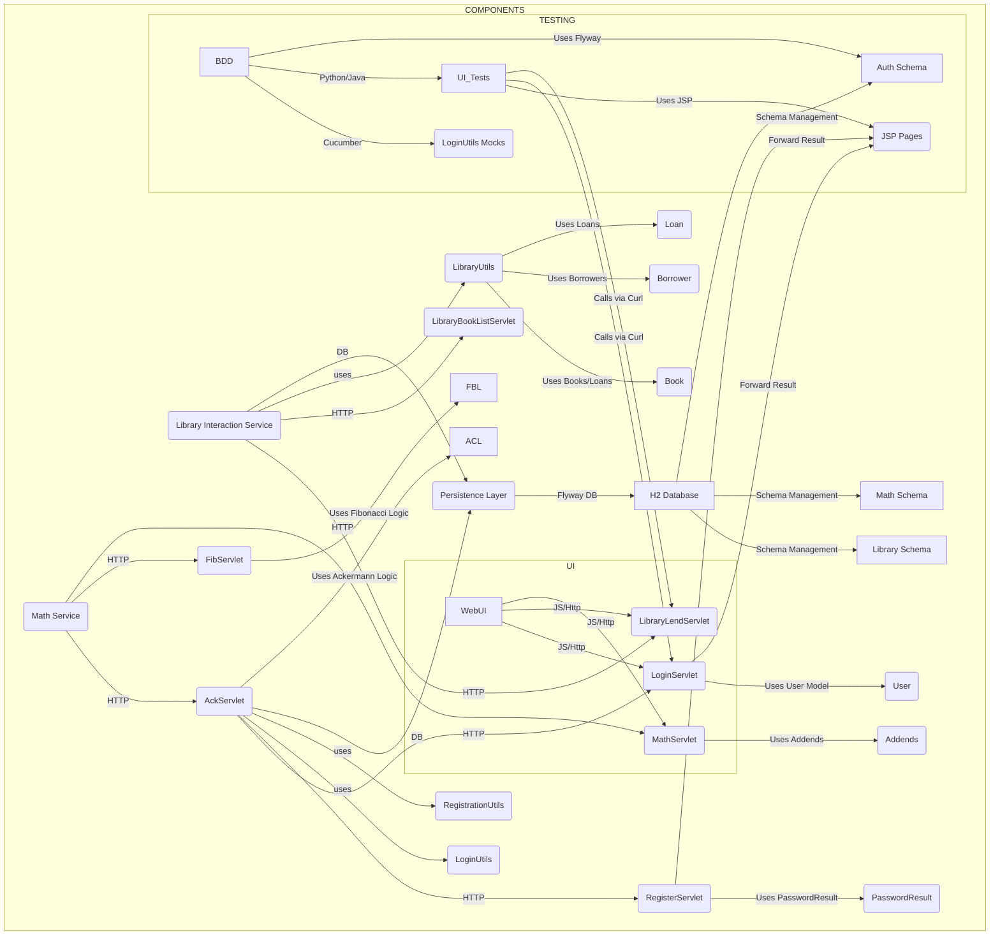

<think>
Okay, let's see what I need to do here. The user wants me to create a component-level architecture diagram using Mermaid's graph TB syntax and a short rationale explaining the component boundaries and communication patterns based on the provided codebase summaries.

First, I should go through each summary chunk (1, 2, 3) and identify the main components, their interactions, and dependencies. From the summaries, the key components seem to be Authentication Service, Library Management Service, Math Calculation Service, and a shared Persistence Layer. Also mentioned are UI (Web/Desktop) and Testing components.

In the first summary, the Authentication service involves servlets like LoginServlet and RegisterServlet, which use LoginUtils and RegistrationUtils, accessing the User model and the database via the Persistence Layer. The Library service has servlets for books, borrowers, and loans, using LibraryUtils. The Math service has AckServlet and FibServlet with their own logic. The database uses H2 and Flyway migrations.

The second summary adds more details about the Persistence Layer, with IPersistenceLayer interface and implementation, and DB schemas for different services. It also mentions other utility classes and tests.

The third summary organizes the services again, emphasizing component classes, interfaces, and models. It clarifies the separation into Authentication, Library, Math, Persistence, and Tests.

So the main services to represent are Authentication, Library, Math, and Persistence. The tests and UI (Web/Desktop) are also important but perhaps secondary components. They interact via HTTP endpoints for services, with the Persistence Layer being shared.

InMermaid, I'll need to represent each service as a component, their dependencies (like Persistence used by Authentication and Library), and the communication channels (HTTP, DB, etc.). The UI components would communicate with the authentication and library services via HTTP.

The rationale should explain why these components are separated that way. For example, each service has its own domain logic and endpoints, the Persistence Layer is shared but tailored to each service, and the UI and tests interact with them through APIs.

I need to make sure the diagram shows the key components and their interactions, using appropriate labels and arrows. Testing components like BDD tests or UI tests (Java, JS, etc.) would connect to the services via their endpoints.

Let me structure the Mermaid diagram accordingly, grouping the components as services and their interactions. Then, write a concise rationale that explains the boundaries and communication patterns based on the code summaries.
</think>

### Rationale
The component boundaries are defined by functional domains (Authentication, Library management, Math operations) and shared infrastructure (Persistence layer). Services communicate via HTTP endpoints (servlets like `LoginServlet`, `LibraryLendServlet`) for business logic, while the Persistence Layer (`IPersistenceLayer`) abstracts database interactions. The H2 Database is versioned via Flyway, separating schema types into authentication, library, and mathematical operations for modularity. Testing components access services via mocks or direct API calls, reflecting decoupled interactions. The UI (Web/Desktop) interacts with these services through standardized HTTP/JavaScript interfaces. This decomposition supports microservice isolation while maintaining shared data access and lifecycle management.