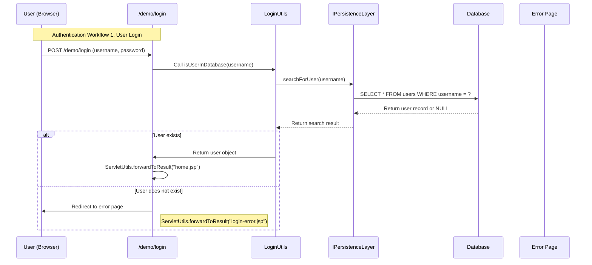
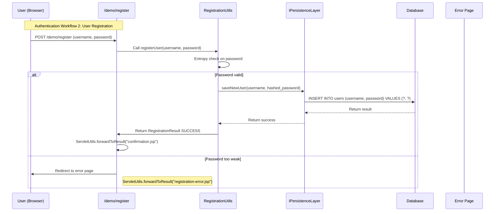
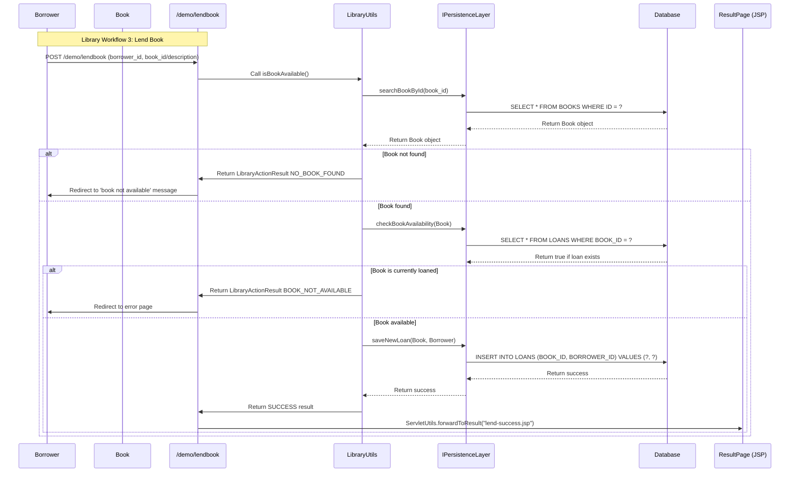
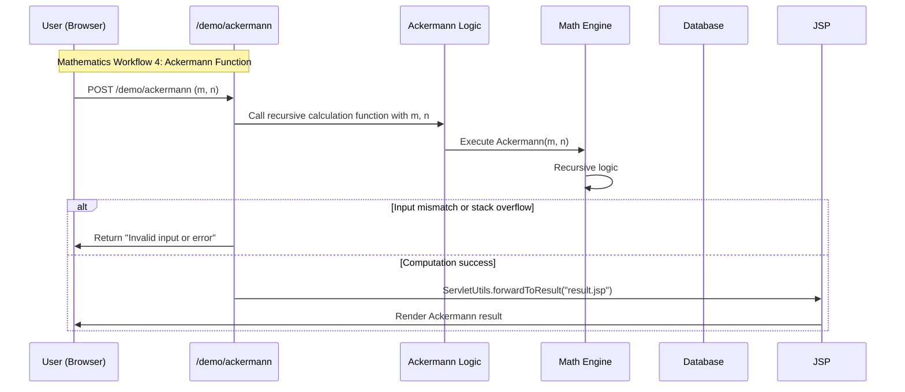
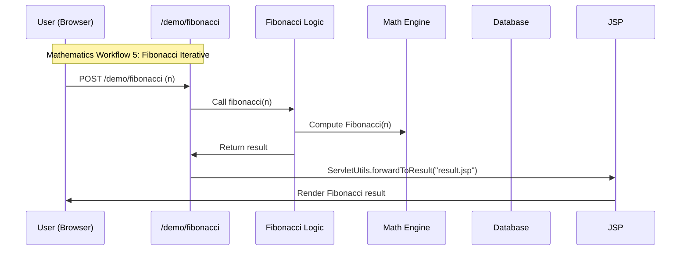

<think>
Okay, I need to analyze the codebase summary provided and create detailed sequence diagrams for the key workflows. Let me break down the information. The code is part of a Java web application using servlets and includes authentication, library management, and mathematical operations. The main components are servlets, utility classes, domain models, and a persistence layer.

First, the authentication flows involve login and registration. The LoginServlet and RegisterServlet interact with LoginUtils and RegistrationUtils, which in turn use the PersistenceLayer for database operations. Each of these utilities performs validation (like password entropy checks) and interacts with the database via Flyway migrations. So a sequence diagram for authentication would start with a user submitting a request to /login or /register, followed by servlet calling the respective utility class, which then communicates with the persistence layer. Error handling would be part of this flow, like redirecting to an error page if validation fails.

For the library management workflow, the key operations include lending books, searching, and viewing available books. The servlets here (LibraryLendServlet, LibraryBookListAvailableServlet) talk to LibraryUtils, which checks availability and performs operations. The persistence layer is again used to get data, and if there are errors like a book not being available, the system should handle that by returning an appropriate result.

Then there's the mathematics operations, like Fibonacci and Ackermann functions. The servlets (FibServlet, AckServlet) interact directly with the calculation logic. Since these are stateless, the flow is simpler—servlet receives parameters, calls the computation method, returns the result. No persistence layer is involved here except for possible configuration.

Each workflow needs to capture the interactions between the servlet, business logic, persistence layer, and error handling. The communication is synchronous, with HTTP POST requests to the servlets. The library flow also involves checking a user is registered and if the book is available, which introduces conditional branching.

I'll need to create a sequence diagram for each of these. The first one is the authentication workflow. The user sends a POST to login, servlet routes to LoginUtils, which validates and checks the persistence layer. If valid, user is authenticated; otherwise, an error is shown.

The next is the library lending flow. User sends a POST to /lendbook, which triggers the LibraryLendServlet. The LibraryUtils class checks borrower and book in the persistence layer, logs the loan, and returns a result like success or book not available. If the book is already lent, an error is generated.

Third, the Fibonacci calculation. User submits POST to /fibonacci, servlet calls FibonacciIterative, which computes the result. If an error occurs during calculation (like input validation), it's returned to the user.

The sequence diagrams should show each step in order, with actors like the user, servlet classes, business utilities, persistence layer, and database. Synchronous messages as arrows, with optional return in case of errors. I'll make sure to use Mermaid syntax for the diagrams, using participants to define the entities and sequences for the steps. Need to clearly indicate the flow and possible error handling in each diagram.
</think>

---

**Description**:  
This sequence diagram captures the authentication workflow for logging in. When a user submits their credentials, the LoginServlet forwards the request to the LoginUtils business logic layer, which utilizes the IPersistenceLayer to check the database for a matching user. If successful, the user is redirected to the home page. If not found or invalid credentials, an error page is displayed.

---

---

**Description**:  
This workflow shows how a new user registers on the system. The RegisterServlet uses the RegistrationUtils to validate the password (via entropy check) and persists the user using the IPersistenceLayer. If the password is invalid or the user is not persisted, the system redirects to a registration error page.

---

---

**Description**:  
This sequence outlines the logic for lending a book to a borrower. If the book is not found in the library database or is already on loan, the borrower is redirected to an error page. If both the book and borrower are valid, a new loan is registered in the database.

---

---

**Description**:  
In this workflow, the AckServlet handles a request to compute the Ackermann function. It uses the AckermannIterative class to perform the computation. If the input is mismatched or causes a calculation error (like stack overflow), an error is returned; otherwise, the computed result is passed to the JSP for rendering.

---

---

**Description**:  
The FibServlet receives a request to calculate the nth Fibonacci number using an iterative approach. The FibonacciIterative class performs the calculation and returns the result to the servlet, which is then passed to a JSP for rendering. This workflow has no persistence layer interaction because it is purely a mathematical operation.