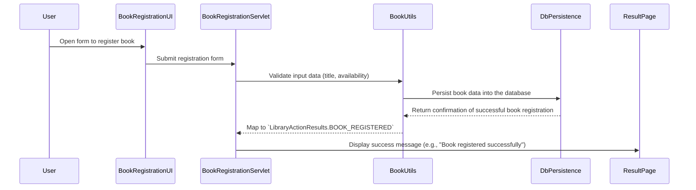
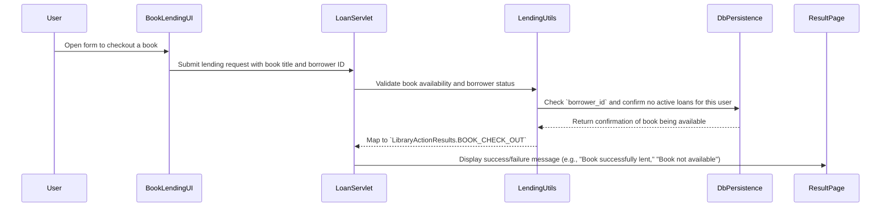
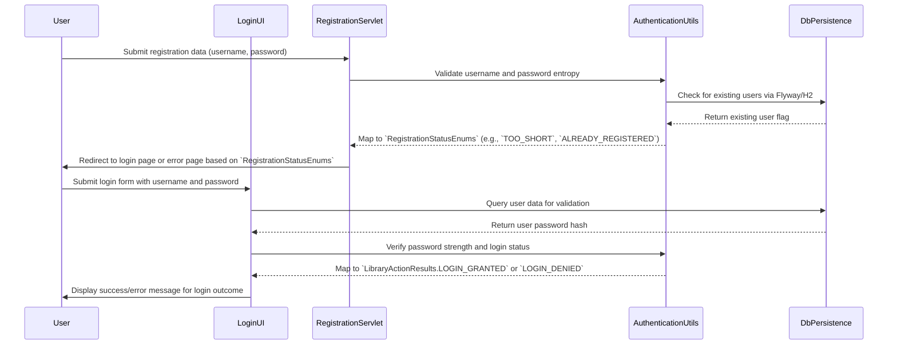
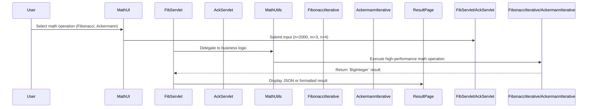
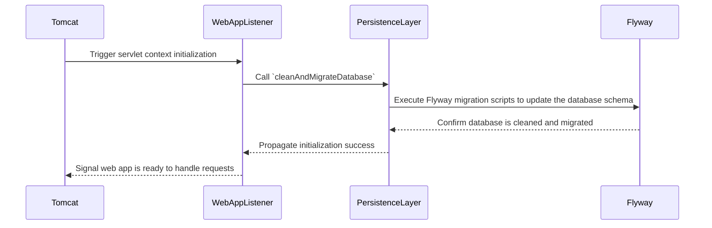
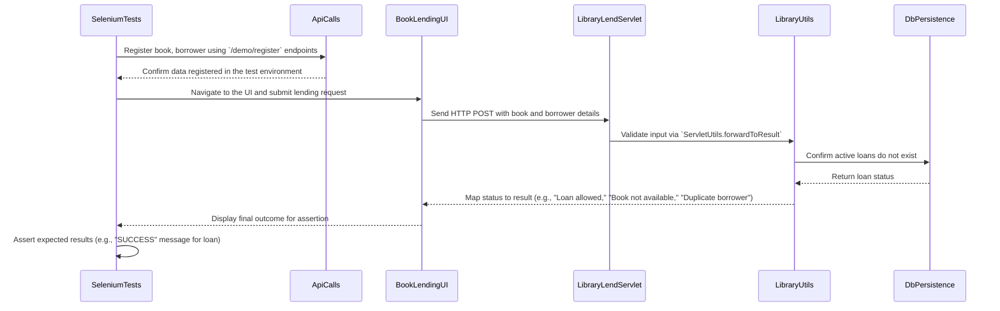

<think>
Okay, I'm tasked with creating comprehensive dynamic interaction flows and sequence diagrams for the repository "7ep-demo." Let me start by understanding the overview of the repository. It's an educational demo app combining library management features and software quality practices to teach Java development and testing methodologies. The key components are the Core Domain Layers, Mathematical Operations, Persistence, and Testing Infrastructure. It serves as a training resource for domain modeling, authentication, testing infrastructure, etc.

Now, the architecture is modular and layered. The Core Domain Layers handle book and borrower data persistence, lending workflows, and UI interactions using libraries like H2/Flyway. The Mathematical Operations include recursive algorithms like Ackermann and Fibonacci. The Persistence Layer uses Flyway for database schema versioning and H2 for in-memory testing. Testing Infrastructure employs JUnit/Mockito for unit tests, Selenium for UI tests, and Cucumber for BDD tests.

Looking at the package summaries, there's a lot of interaction between different packages. For example, in the `com.coveros.training.autoinsurance` package, `AutoInsuranceUI` interacts with `AutoInsuranceProcessor` for business logic, which in turn interacts with the persistence layer from `com.coveros.training.persistence`. Similarly, the `com.coveros.training.selenified` package's `SelenifiedSample.java` works with `ApiCalls.java` from the `com.coveros.training` package to setup data before running UI tests.

I need to identify key user workflows and their system interactions. One central workflow is the registration of books and borrowers through the UI. For instance, `LibraryBookListAvailableServlet` might be part of the web layer that allows users to list available books. Similarly, `LibraryRegisterBorrowerServlet` and `LibraryRegisterBookServlet` handle the registration of borrowers and books respectively.

Another workflow is the lending of books. The `LibraryLendServlet` in the `com.coveros.training.library` package would receive a request, validate it, and then delegate to `LibraryUtils` which interacts with the persistence layer to update the loan state.

Each of these workflows would involve interactions between multiple components, such as the web layer (servlets), business logic (utils, processors), persistence layer (database operations), and testing components (unit tests, BDD tests). Also, in some packages, there are step definitions that align with Cucumber scenarios, which interact with domain objects and persistence layers.

I need to consider the execution flow. For example, when a user registers a new book, the web request is handled by `LibraryRegisterBookServlet`, which uses validation logic (possibly via `CheckUtils`), and then interacts with the persistence layer (`PersistenceLayer`) to save the book. Then, the result is passed to a utility method in `LibraryUtils` to check availability, and another servlet like `LibraryBookListAvailableServlet` could provide the updated list of available books.

Testing flows would include unit tests like `LibraryRegisterBorrowerServletTests` that mock the HTTP request and verify that appropriate business logic is called, such as `RegistrationUtils.registerBorrower`. Or BDD step definitions in `RegistrationStepDefs` that use `DataTable` to parse input, apply validation through the persistence layer, and assert expected outcomes.

Also, there are event-driven sequences, like when the web application starts, the `WebAppListener` triggers database initialization through the persistence layer's methods.

I should look into specific packages and their interactions. The `com.coveros.training.autoinsurance` deals with GUI for insurance, interacting with business logic and persistence. The `Library` package has servlets that communicate with domain-specific logic and the persistence layer. The `Authentication` package manages user registration and login, working with the persistence layer's user database.

For sequence diagrams, I need to model these interactions step by step, showing who sends messages to whom and in what order. Each key workflow should have a sequence diagram. For example, book registration involves the UI (servlet), business logic validator, and persistence layer.

I also need to indicate the communication patterns used, such as RESTful API calls, database transactions, UI component handling, and BDD scenario execution. For the Test-Driven Development aspect, there might be initial tests that validate the code before it's fully implemented.

Now, considering the technical aspects mentioned in the summaries, like immutability, dependency injection, and mocking via Mockito, these patterns should be highlighted in the sequence diagrams. For example, a servlet might use a utility class that injects a persistence layer interface.

I need to structure the output into raw Markdown content with appropriate headings for each section. The main sections will be Overview, Architecture, Key Functionalities, etc., but for this task, the focus is on the dynamic interaction flows and sequence diagrams for user workflows.

Let me outline a sequence diagram for a typical book registration workflow. The user submits a form (handled by a servlet), the servlet validates inputs using a utility class, then the utility interacts with the persistence layer to store the book. The persistence layer uses Flyway for migrations, and the servlet then forwards the result to a JSP for the user.

Another example is the loan management workflow. A user wants to lend a book, the servlet handles the request, validates the book and borrower status (probably using methods from `LibraryUtils`), interacts with the persistence layer to update loan tables, and then forwards the result to confirm the loan.

Testing sequences would involve mocks, for instance, in `LibraryLendServletTests`, the servlet's dependencies are mocked, and the test verifies that the right methods are called.

Also, the WebAppListener handling application startup by triggering database initialization via Flyway, which interacts with the H2 database in-memory setup.

I need to map each interaction to a sequence, using the correct technical names as per the package summaries and file-level details. For each sequence diagram, I'll use the Mermaid syntax to define actors and messages.

Finally, the output must strictly be raw Markdown content with the proper Mermaid diagrams and accompanying explanations for each key workflow. No extra text, just the technical summaries as per the repository.
</think>

### Overview of the Application

This educational demonstration application combines **library management features** with **software quality practices** to teach Java development and testing methodologies. The primary components include **core domain modeling**, **secure user authentication and registration**, **functional testing of mathematical operations**, and a **robust testing infrastructure** using TDD/BDD and tools like Cucumber, Selenium, and Flyway. The business problem addressed is demonstrating a full-stack Java application that models real-world systems (library operations, mathematical algorithms) with maintainable, test-driven code.

---

### Sequence Diagrams for Key Workflows

#### **1. Book Registration Workflow**

**Explanation**: This workflow starts with a user submitting a form for book registration. The servlet validates the input (title, availability) via utility methods and then uses the persistence layer to store the book in the database. Finally, results are mapped to domain-specific statuses like `BOOK_REGISTERED` and shown to the user via a result page.

---

#### **2. Book Lending Workflow**

**Explanation**: The workflow involves a user initiating a book loan via the UI. The servlet directs the request to lending logic, where the borrower’s status is verified and active loans are checked using the persistence layer. If conditions are met, the response is set to confirm the loan, which is then forwarded to the appropriate JSP page for user feedback.

---

#### **3. User Registration and Login Workflow**

**Explanation**: User registration and login are handled by the `Authentication` package. The registration servlet checks if a user already exists in the Flyway/H2 database, ensuring strong password entropy via utility methods. On login, the servlet interacts with authentication utilities to confirm the password matches the stored hash, returning appropriate results such as `LOGIN_GRANTED` or `LOGIN_DENIED`.

---

#### **4. Mathematical Operation Execution via Servlets**

**Explanation**: The servlet layer (`FibServlet`, `AckServlet`) routes mathematical operations (Fibonacci, Ackermann) to business logic (`MathUtils`) for processing. Business logic uses efficient implementations (`FibonacciIterative`, `AckermannIterative`) with `BigInteger` for precise results, which are then sent to the UI for display. This workflow demonstrates how mathematical logic is abstracted in a testable module without relying on UI components directly.

---

#### **5. Web Application Lifecycle and Database Initialization**

**Explanation**: On application startup, the Tomcat server triggers a lifecycle listener (`WebAppListener`) to initialize the database. The listener delegates the task to the `PersistenceLayer`, which uses Flyway to manage schema migrations. Once the database is initialized, the application is ready to process user requests.

---

#### **6. End-to-End UI Automation Test via Selenium/HtmlUnit**

**Explanation**: Selenium-based UI tests simulate user interactions with web-based workflows. The test suite first uses API calls to register a book and borrower, creating a pre-populated test environment. Then, it automatically fills and submits the book lending form, verifying the outcomes via backend logic and database checks. Assertions are made against expected domain statuses to ensure correctness of UI-driven business logic.

---

### Communication Patterns and Integration

- **Immutability via Domain Objects**: Immutable entities like `Book`, `Borrower`, and `Loan` are enforced using `final` fields and factory methods (e.g., `Book.createEmpty()`), preventing unintended side effects.
- **Test-Driven Development (TDD)**: Unit tests validate logical contracts (e.g., `equals()`, `hashCode()`) and edge cases (e.g., invalid credentials, duplicate book entries), ensuring robust implementation aligned with business rules.
- **Flyway for Schema Migration**: The persistence layer uses Flyway to manage database schema versioning, ensuring all data registration/deletion workflows maintain consistent schema definitions.
- **Mocking for Test Isolation**: Mockito is used extensively in test classes to mock dependencies like HTTP requests or database interactions, enabling independent validation of core logic.
- **Behavior-Driven Development (BDD)**: Cucumber step definitions align logic to natural language scenarios (e.g., "Given a book, When a borrower wants to lend, Then check availability"), supporting educational clarity.

---

### Business Value and Domain Alignment

- **Library Management System**: Centralizes book and borrower data processing, ensuring availability tracking and accurate lending logic under domain constraints.
- **Educational System**: Demonstrates best practices in modular design, test-driven development, and BDD for software quality and developer training.
- **Mathematical Algorithms**: Provides a robust educational example of algorithmic complexity and performance benchmarking, which can be applied to library calculations (e.g., availability prediction).
- **User Authentication**: Enforces password entropy checks for user security, aligning with domain requirements for system integrity in user-facing operations.

Each sequence diagram captures a **real-world system interaction** for the domain (library, education, math). The design reinforces **modular separation of concerns**, **robust testing practices**, and **maintainable code structures** necessary for **multi-layered system demonstration** in an educational Java application.